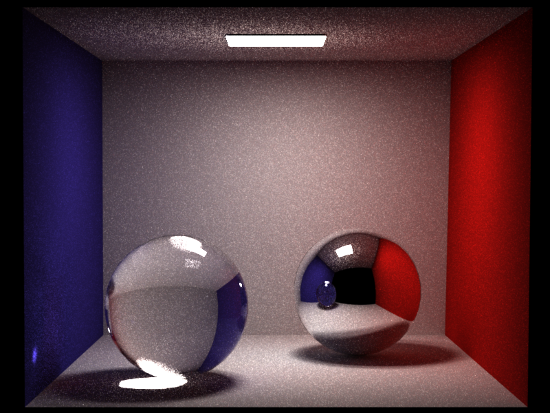
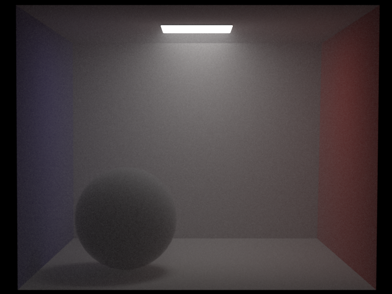
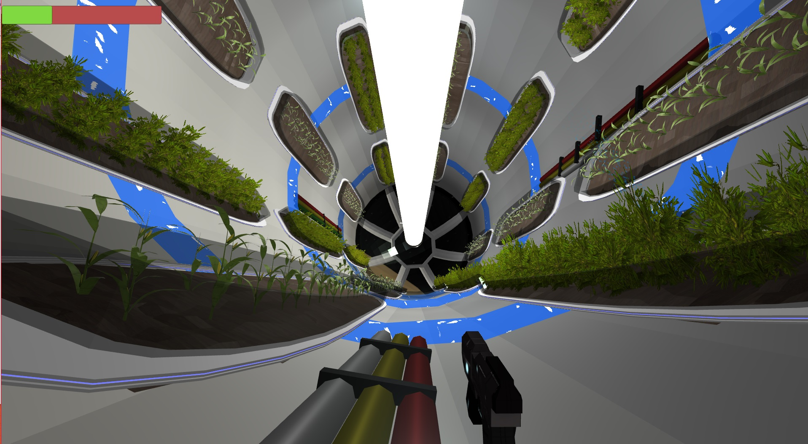

  <h3>Projects</h3>
  <a href="#740">Nori</a> 
   
  <a href="#425">Unity3D</a> 
   
  <a href="#417">Bittorrent</a> 
   

  <body>
  
  <h3 id="740"> Nori Raytracer </h3>
  

    
    
     
    <a href="https://github.com/KyleBeebe/Nori-Raytracer">Repository</a> 
     
    <a href="https://github.com/KyleBeebe/Nori-Raytracer/tree/master/Reports/PDF">Technical Reports</a> 
     
    The is an educational raytracer that I've been extending with extra features and functionality. Full path tracing has been implemented with support for diffuse, specular, and dielectric materials. The most recent addition was the implmentation of a volumentric rendering integrator. It allows the rendering of homogeneous mediums such as environmental fog. 
  

  
   
   
  
  <h3 id="425"> Unity3D SpaceGame </h3>
  
 
    
    <a href="https://www.youtube.com/watch?v=S0BBw31RJLE&t=6s">Video Demo</a> 
     
    <a href="https://github.com/KyleBeebe/UnitySpaceGame">Repository</a> 
     
    This was created in Unity3D to show case some of the game programming techniques developed in CMSC 425 at UMD. 
    It was create as a team of three. All scripts were created using C#. The premise is a first person shooter on a space ship fighting 
    robots. The main gimmicks were the cubic Bezier curve based grappling hook, the centrifuge style level that allowed traversal along the inside walls, and the few destructible items within the environment. 
  

  
   
   
  
  <h3 id="417"> Bittorrent Client </h3>
  

    <a href="https://github.com/KyleBeebe/Bittorrent-Client">Repository</a> 
     
    A command line Bittorrent client created using C++ that handles single file torrents. The client is able to communicate with 
    public bittorrent trackers via TCP http get requests and exchanges file data with other clients via UDP. 
  

  
  </body>

