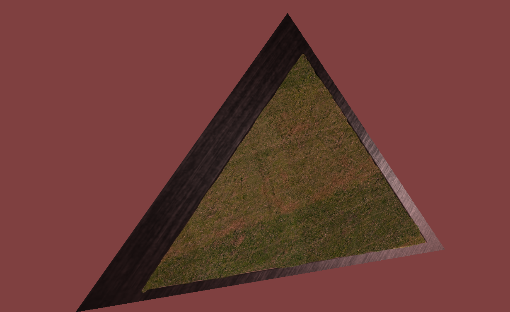
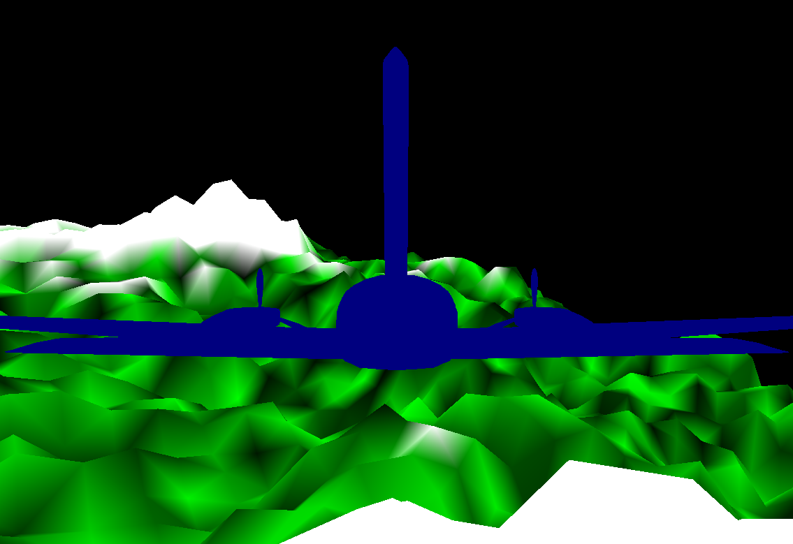

  <h3>Projects</h3>
  <a href="#740">Nori</a> 
   
  <a href="#425">Unity3D</a> 
   
  <a href="#OpenGL">OpenGL</a> 
   
  <a href="#417">Bittorrent</a> 
   
  <a href="#420">PMQuadtree</a> 
   

  <body>
  
  <h3 id="740"> Nori Raytracer </h3>
  

    
    
     
    <a href="https://github.com/wjakob/nori">Repository</a> 
    (Repo forked from; Removed mine due to University legal issues)
     
    <a href="https://github.com/KyleBeebe/KyleBeebe.github.io/blob/master/reports/Volumentric%20Rendering%20with%20Homogeneous%20media.pdf">Technical Reports</a> 
     
    The is an educational raytracer that I've been extending with extra features and functionality. An octree was created to partition the 3D scene and accerlate ray traversal, sample warping functions to help with sampling bsdf's, and various effects such as ambient occlusion. Additionally, full path tracing has been implemented with support for diffuse, specular, dielectric, and microfaceted materials. The most recent addition was the implementation of a volumentric rendering integrator. It allows the rendering of homogeneous mediums such as environmental fog with directed scattering via 
  the Henyey-Greenstein phase function model. 
  

  
   
   
    
    <h3 id="425"> Ds4Vita contribution </h3>
  
 
    <a href="https://github.com/KyleBeebe/UnitySpaceGame">Repository</a> 
     
      
     
    I was bored during the start of the COVID lockdowns and got into PS Vita homebrew. I needed an application that allowed me to hook up a wired controller while another application allowed me to mirror the Vita screen on my pc desktop. Xerpi's Ds4Vita allowed this. I ended up fixing a crash when you bring up the OS menu and added mapping from the rear touchpad to the L2 and R2 triggers on the Dualshock 4 controller.    
  

  
  
  
   
   
  
  <h3 id="425"> Unity3D SpaceGame </h3>
  
 
    
    <a href="https://www.youtube.com/watch?v=S0BBw31RJLE&t=6s">Video Demo</a> 
     
    <a href="https://github.com/KyleBeebe/UnitySpaceGame">Repository</a> 
     
     <a href="https://kylebeebe.github.io/SpaceGamePlayer">WebGL player</a> 
     
    This was created in Unity3D to show case some of the game programming techniques developed in CMSC 425 at UMD. 
    It was create as a team of three. All scripts were created using C#. The premise is a first person shooter on a space ship fighting 
    robots. The main gimmicks were the cubic Bezier curve based grappling hook, the centrifuge style level that allowed traversal along the inside walls, and the few destructible items within the environment. 
  

  
  
  
   
   
  
  <h3 id="OpenGL"> OpenGL 4.6 engine </h3>
  

    
    <a href="https://github.com/KyleBeebe/OpenGLEngine">Repository</a> 
     
    An in-progress OpenGL 4.6 engine in C++.  I have been generally following https://learnopengl.com/ but adhering to an OOP design 
  by separating components into logical classes. The objective to get a better farmiliarization with the modern OpenGL pipeline. A virtual camera has been implemented with yaw, pitch, and rolling. Basic 3D shapes with textures can be rendered. The default shaders can deal with diffuse and specular map textures. 
  

  
  <h3 id="427"> OpenGL extensions </h3>
  

    
    <a href="https://github.com/KyleBeebe/OpenGLJava">Repository</a> 
     
    Showcases a few Java OpenGL extensions implemented as part of CMSC 427 (Computer Graphics). A barebones OpenGL framework was provided. Tasks include implementing animation trees, orbiting cameras, trackball cameras, lighting shaders, and procedural terrain  mesh generation. 
  

  
   
   
  
  <h3 id="417"> Bittorrent Client </h3>
  

    <a href="https://github.com/KyleBeebe/Bittorrent-Client">Repository</a> 
     
    A command line Bittorrent client created using C++ that handles single file torrents. The client is able to communicate with 
    public bittorrent trackers via TCP http get requests and exchanges file data with other clients via TCP connections. 
  

  
   
   
  
  <h3 id="420"> PMQuadtree </h3>
  

    <a href="https://github.com/KyleBeebe/PMQuadtree">Repository</a> 
     
    
Program in Java based around the PMQuadtree data structure by Hanan Samet. It is a trie based polygonal map that partitions the space based on keys. 
The project involved mapping cities as points and roads + airports as edges connecting cities. The application finds the shortest route between the cities using Dijkstra's algorithm. 
  

  
  </body>

